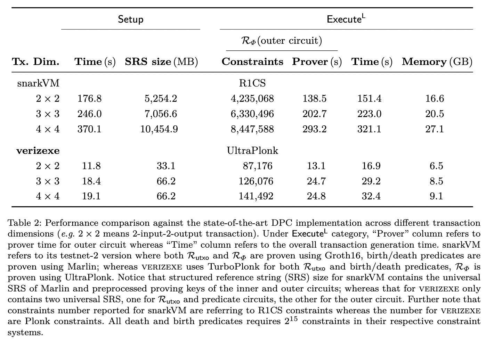

# VERI-ZEXE: Decentralized Private Computation with Universal Setup

This repository contains an implementation of the DPC scheme called VERI-ZEXE [[XCZ+22]](https://eprint.iacr.org/2022/802).

This library is released under the GPLv3 License (see [License](./LICENSE)).

WARNING: This is an academic proof-of-concept prototype, and in particular has not received careful code review. This implementation is NOT ready for production use.

## Getting Started

Ensure you have the following installed:

- [`nix`](https://nixos.org/download.html)
- [`direnv`](https://direnv.net/docs/installation.html)

Then, run `direnv allow` at the project root, you should see all dependencies installed.

Feel free to explore `src/examples` folder for example applications (including simplified Zcash, Zcash, TornadoCash) built on top of the VERI-ZEXE.

## Benchmark

Please refer to [[XCZ+22]](https://eprint.iacr.org/2022/802) for detailed benchmark running on AMD EPYC 7R13 at 2.65 GHz with 128 GB of RAM.



You could also run `cargo test dpc_bench -- --nocapture` locally.

## Citation

```bibtex
@misc{cryptoeprint:2022/802,
      author = {Alex Luoyuan Xiong and Binyi Chen and Zhenfei Zhang and Benedikt Bünz and Ben Fisch and Fernando Krell and Philippe Camacho},
      title = {VERI-ZEXE: Decentralized Private Computation with Universal Setup},
      howpublished = {Cryptology ePrint Archive, Paper 2022/802},
      year = {2022},
      note = {\url{https://eprint.iacr.org/2022/802}},
      url = {https://eprint.iacr.org/2022/802}
}
```
